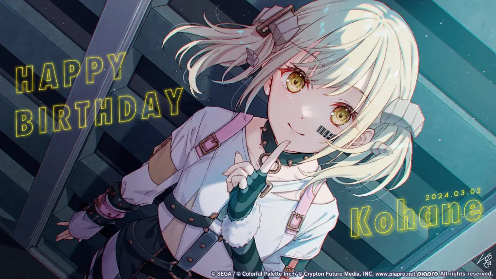

<!-- markdownlint-disable MD033 MD041 -->
<div align="center">
  
</div>

<div align="center">
  <a href="./LICENSE">
    
  </a>
  <a href="https://www.python.org">
    
  </a>
  <a href="https://nonebot.dev/">
    
  </a>
  <a href="https://onebot.dev/">
    
  </a>
  <a href="https://github.com/Microsoft/pyright">
    
  </a>
  <a href="https://github.com/astral-sh/ruff">
    
  </a>
  <a href="https://deepwiki.com/PoleSudBot/Bot">
    
  </a>
</div>

# PoleSudBot

PoleSudBot 是一个基于 [zhenxun_bot](https://github.com/zhenxun-org/zhenxun_bot) 修改维护的 Bot 项目。


## 简单部署

推荐环境：Python 3.10+、`uv`

```bash
git clone https://github.com/PoleSudBot/Bot.git PoleSudBot
cd PoleSudBot

pip install uv
uv run --no-project nbm.py prod-setup
uv run bot.py
```

`prod-setup` 会按 [plugins.txt](./plugins.txt) 拉取当前使用的插件源码，并以 `pyproject.toml` 为主完成依赖同步；当检测到插件提交、`manage.toml` 或 `pyproject.toml` 变化时，会自动重建 `uv.lock`。

如需一键更新主仓库、resources 和插件源码，可执行：

```bash
uv run --no-project nbm.py update
```

`update` 会自动忽略并覆盖主仓库中本地漂移的 `uv.lock`；若主仓库还有其他已跟踪修改，仍会立即中止，需先手动清理工作区。主仓库更新成功后，后续 resources、插件和 sidecar 仓库会按仓库逐个同步；单仓库失败不会打断剩余同步，命令结束时会统一汇总成功/失败情况，并在存在失败项时返回非零退出码。

## 简单配置

1. 当前仓库通过 `.env` 选择开发环境，主要配置文件为 `.env.dev`。
2. 先在 `.env.dev` 中填写 Bot 连接相关配置，并确认本地路径配置可用，例如 `FFMPEG`。
3. 首次启动后，如需继续调整插件或系统配置，可再检查 `data/config.yaml`。

## 致谢

### 基础项目与协议生态

- [zhenxun_bot](https://github.com/zhenxun-org/zhenxun_bot)
- [NoneBot2](https://github.com/nonebot/nonebot2)
- [OneBot](https://github.com/howmanybots/onebot)
- [NapCat](https://github.com/NapNeko/NapCatQQ)
- [Lagrange](https://github.com/LagrangeDev/Lagrange.Core)
- [LLOneBot](https://github.com/LLOneBot/LLOneBot)

### 当前使用插件

- [nonebot-plugin-today-waifu](https://github.com/glamorgan9826/nonebot-plugin-today-waifu)
- [nonebot_plugin_fortune](https://github.com/MinatoAquaCrews/nonebot_plugin_fortune)
- [nonebot_plugin_tarot](https://github.com/MinatoAquaCrews/nonebot_plugin_tarot)
- [nonebot-plugin-whateat-pic](https://github.com/Cvandia/nonebot-plugin-whateat-pic)
- [nonebot-plugin-ottohzys](https://github.com/lgc-NB2Dev/nonebot-plugin-ottohzys)
- [nonebot-plugin-multincm](https://github.com/lgc-NB2Dev/nonebot-plugin-multincm)
- [nonebot_plugin_githubcard](https://github.com/ElainaFanBoy/nonebot_plugin_githubcard)
- [nonebot-plugin-wordcloud](https://github.com/he0119/nonebot-plugin-wordcloud)
- [nonebot-plugin-memes](https://github.com/MemeCrafters/nonebot-plugin-memes)
- [nonebot-plugin-heweather](https://github.com/kexue-z/nonebot-plugin-heweather)
- [nonebot-plugin-paper](https://github.com/BalconyJH/nonebot-plugin-paper)
- [YetAnotherPicSearch](https://github.com/lgc-NB2Dev/YetAnotherPicSearch)
- [nonebot-plugin-sticker-saver](https://github.com/colasama/nonebot-plugin-sticker-saver)
- [nonebot-plugin-tsugu-bangdream-bot](https://github.com/WindowsSov8forUs/nonebot-plugin-tsugu-bangdream-bot)
- [nonebot-plugin-manosaba-memes](https://github.com/zhaomaoniu/nonebot-plugin-manosaba-memes)

## 说明

- 当前插件列表由 `plugins.txt` 管理。
- 常规部署推荐使用 `uv run --no-project nbm.py prod-setup`。
